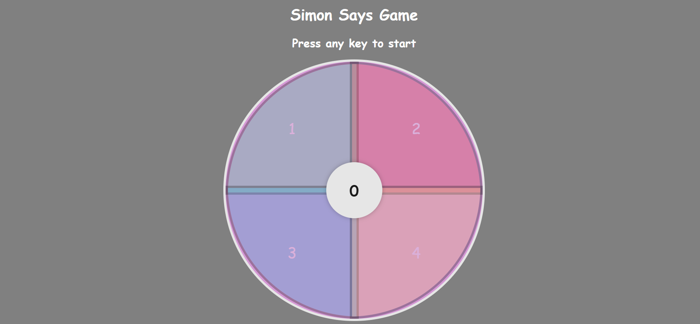

## 🧠 How the Game Works

1. Press any key to start.
2. The game flashes a sequence of buttons.
3. Repeat the sequence by clicking the buttons.
4. Each correct round adds one new step.
5. A wrong click ends the game.

---

